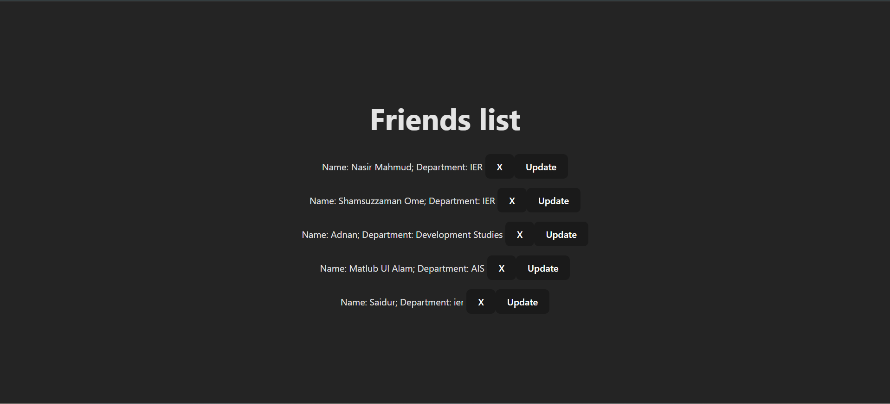
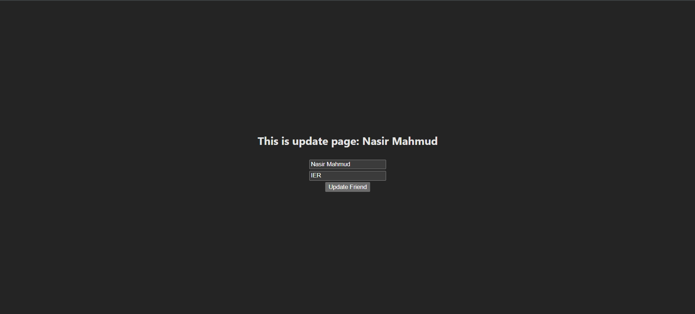

# Friends Client Frontend

This is the frontend of the Simple CRUD Friends App built with **React**. It allows users to create, view, update, and delete friends data through a friendly user interface.

---

## 🚀 Features

- List all friends
- Add a new friend
- Update friend information
- Delete a friend
- Interacts with backend REST API

---

## 🛠️ Tech Stack

- React
- React Router
- Fetch API
- Tailwind CSS (if used)
- React Hooks

---

## 📁 Project Structure

```
.
├── src/
│   ├── components/        # Reusable components
│   ├── pages/             # Pages like Home, Update
│   ├── App.jsx            # Main App component
│   └── main.jsx           # Entry point
├── public/
├── package.json
└── ...
```

---

## ⚙️ Setup & Run Locally

1. **Clone the Repository**

```bash
git clone https://github.com/mahii060/simple-crud-client-friends.git
cd simple-crud-client-friends
```

2. **Install Dependencies**

```bash
npm install
```

3. **Start the Development Server**

```bash
npm run dev
```

> The frontend will run on `http://localhost:5173` by default

---

## 🌐 Backend API Used

Make sure the backend is running at:  
`http://localhost:5000`  
(You can change it in your fetch URLs if different.)

---

## 📸 Screenshots

### 🏠 Home Page


### ➕ Add Friend Page



### 📝 Update Friend Page

---

## 🙌 Author

- [@mahii060](https://github.com/mahii060)

---

## 📄 License

Open-source and free to use for educational and personal projects.
